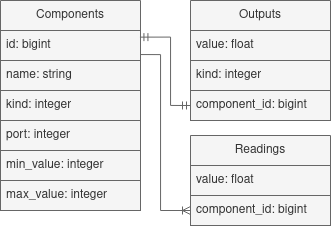

# Navegação <!-- omit in toc -->

- [**Sobre**](#sobre)
  - [Começo](#começo)
  - [Banco de dados](#banco-de-dados)
- [**Interface**](#interface)
- [**Comunicação com o microcontrolador**](#comunicação-com-o-microcontrolador)
  - [Mensagens](#mensagens)
- [**Próximos passos**](#próximos-passos)
  - [Desafios e considerações](#desafios-e-considerações)

# **Sobre**

## Começo

Esta é a primeira versão do projeto **The Amazing Flower Monitor** (emot). A versão terá menos componentes e demandará menos programação. Abaixo apresento um diagrama de como será a estrutura base desta versão.

<div align="center">
  
  <p>Versão com menos componentes.</p>
</div>

A seguir, apresento a descrição de cada um dos componentes desta versão.

- **App**: O componente App será uma aplicação desenvolvida em Ruby On Rails, e será o principal recurso usado para validar a ideia;
- **NodeMCU**: Como podemos ver no diagrama, temos um microcontrolador, que neste caso é um NodeMCU,versão Lolin V3;
- **DB**: O gerenciador de banco de dados utilizado será o PostgreSQL.

O ambiente de desenvolvimento do código usado no microcontrolador será o ArduinoIDE.

## Banco de dados

Na figura abaixo temos uma das primeiras versões da estrutura do banco de dados utilizado nesta versão.

<div align="center">
  
  <p>Estrutura do banco de dados da aplicação.</p>
</div>

A descrição de cada entidade é dada a seguir.

- Components: Vão identificar os componentes que serão utilizados (ligados no microcontrolador).
    - name: O nome para aquele componente;
    - kind: O tipo do componente, se é **atuador** ou **sensor**;
    - port: A porta usada para ligar o componente ao microcontrolador;
    - min_value: O valor mínimo que pode ser inserido em uma saída do microcontrolador, para o componente;
    - max_value: O valor máximo que pode ser inserido em uma saída do microcontrolador, para o componente.
- Outputs: A saída que será enviada para um componente. O componente deverá considerar apenas a última saída.
    - value: O valor de saída para aquele componente.
    - kind: O tipo daquela saída. Existem componentes que só possuem a possibilidade de ligar/desligar, não podendo usar a função **analogWrite**, por exemplo.
- Readings: Serão os valores lidos pelos sensores.
    - value: O valor lido pelo sensor.

# **Interface**

A interface é o bloco App, descrito acima. Onde teremos a possibilidade de manipular componentes e suas respectivas saídas, no microcontrolador. A interface não possui muitos detalhes, como cores e outros aspectos de design, não é este o foco. Utilizou-se o Bootstrap 5, para auxiliar na disposição de algumas informações na página.

<div align="center">
  
  <p>Pequena página inicial da aplicação.</p>
</div>

# **Comunicação com o microcontrolador**

A comunicação entre servidor (App) e microcontrolador é feita a partir de mensagens no formato JSON. Inicialmente, o microcontrolador solicita as informações dos componentes que foram cadastrados e realiza as devidas configurações. Verifique a descrição e o código fonte usado no microcontrolador deste projeto, no repositório [emot-mcc](https://github.com/kevendasilva/emot-mcc).

## Mensagens

A seguir, apresento exemplos de mensagens enviadas pelo servidor.

```json
// Componente
{
  "id": 1,
  "name": "LED",
  "kind": "actuator",
  "port": 13,
  "min_value": 0,
  "max_value": 255
}
```

e, para a saída:

```json
// Saída
{
  "value": 255,
  "kind": "digital",
  "component_id": 1
}
```

# **Próximos passos**

Diversos aprendizados foram retirados desta versão do projeto, como: limitações do microcontrolador e do servidor. Algumas tarefas, como a escrita de valores lidos pelos sensores, no banco de dados, acaba não sendo tão eficiente, pois precisamos limitar a quantidade de registros de leituras.

Logo, na próxima versão, deverão ser adotadas medidas para solucionar tais problemas. Alguns dos desafios que devem ser solucionados, são apresentados abaixo.

## Desafios e considerações

- Melhorar a interface: usabilidade e visual;
  - Apresentar os valores lidos pelos sensores, por meio de gráficos.
- Registrar as operações realizadas pelo microcontrolador;
  - Implementar um sistema de log.
- Contornar as limitações do NodeMCU, em relação a quantidade de portas analógicas;
- Criar a CLI do projeto;
- E, melhorar o código do microcontrolador, para que seja capaz de lidar com mudanças efetuadas por meio da interface, após a sua inicialização completa.
